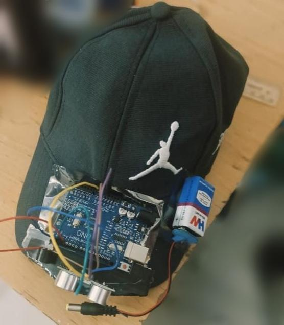

# 🧢 Smart Cap for Visually Impaired Persons

An Arduino-based wearable assistive device designed to help visually impaired individuals detect nearby obstacles using ultrasonic sensing and real-time audio feedback. The system continuously measures the distance to objects in front of the user and alerts them through a buzzer when an obstacle is detected within a predefined range.

---

## 📌 Project Overview

Navigating unfamiliar environments can be challenging for visually impaired individuals due to obstacles that are difficult to detect using a traditional walking cane alone. This project aims to provide an additional layer of safety by integrating an ultrasonic sensor with an Arduino microcontroller to detect nearby obstacles and provide immediate auditory feedback.

The prototype is lightweight, cost-effective, and demonstrates the fundamentals of embedded systems, sensor interfacing, and wearable assistive technology.

---

## ✨ Features

- Real-time obstacle detection
- Audible buzzer alerts
- Wearable cap-based design
- Low-cost and easy to build
- Arduino-based embedded implementation

---

## 🛠️ Hardware Components

| Component | Quantity |
|-----------|---------:|
| Arduino Uno | 1 |
| HC-SR04 Ultrasonic Sensor | 1 |
| Active Buzzer | 1 |
| 9V Battery | 1 |
| Connecting Wires | As required |
| Cap | 1 |

---

## ⚙️ Working Principle

1. The HC-SR04 ultrasonic sensor continuously measures the distance to nearby objects.
2. The Arduino Uno processes the measured distance.
3. If an obstacle is detected within **40 cm**, the buzzer is activated.(Distance can be modified as per the requiment)
4. The buzzer alerts the user about the nearby obstacle.
5. The process repeats continuously in real time.

---

## 🔌 Circuit Connections

| Arduino Pin | Connected Component |
|-------------|--------------------|
| D2 | HC-SR04 Trigger |
| D3 | HC-SR04 Echo |
| D4 | Active Buzzer |
| 5V | Sensor VCC |
| GND | Common Ground |

---

## 📷 Prototype

> Prototype of the wearable smart cap.

## 📷 Prototype

<p align="center">
  
</p>

*Prototype of the Smart Cap showing the Arduino Uno, HC-SR04 ultrasonic sensor, and buzzer mounted on a wearable cap.*

---

## 📂 Repository Structure

```
iot-smart-cap-for-visually-impaired
│
├── README.md
├── IoT_smart_cap.ino
└── images
    └── prototype.jpg
```

---

## 🚀 Future Improvements

- Multiple ultrasonic sensors for wider obstacle coverage
- Vibration motor for silent feedback
- ESP32-based implementation
- Rechargeable Li-ion battery
- Voice guidance system
- GPS-based emergency location sharing
- AI-powered object recognition

---

## 💡 Applications

- Assistive technology for visually impaired individuals
- Embedded systems learning
- Arduino and sensor interfacing projects
- IoT and wearable electronics demonstrations

---

## 👨‍💻 Technologies Used

- Arduino IDE
- Embedded C / Arduino C++
- Ultrasonic Sensor (HC-SR04)
- Embedded Systems
- Electronics Prototyping

---

## 👤 Author

**Varun Kakarla**
Undergraduate
Electronics and Communication Engineering 
SRM Institute of Science and Technology
